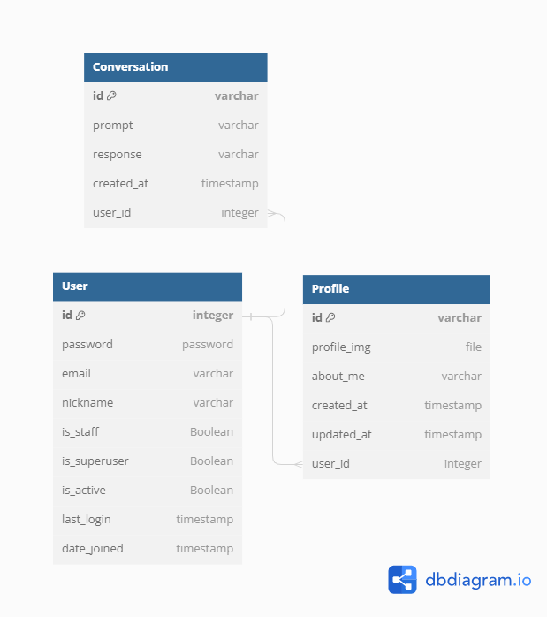

# <span id="top">:computer:Django_chatbot</span>

## 개요
- :minidisc:개인 프로젝트로 진행한 Django_chatbot입니다.
- :space_invader:Django_chatbot ChatGPT API와 연동하여 질문을 던지면 자동으로 ChatGPT 답을 주는 챗봇서비스입니다.

## 목차
<ol>
    <li><a href="#goal">프로젝트 목표</a></li>
    <li><a href="#dev">개발환경 및 배포 URL</a></li>
    <li><a href="#ins">설치 및 실행</a></li>
    <li><a href="#tree">프로젝트 구조</a></li>
    <li><a href="#task">개발기간 및 기능기획관리</a></li>
    <li><a href="#ui">UI</a></li>
    <li><a href="#erd">데이터베이스 모델링(ERD)</a></li>
    <li><a href="#pages">페이지 기능</a></li>
    <li><a href="#issues">개발하며 겪은 이슈</a></li>
    <li><a href="#realization">마무리</a></li>
</ol>
<p align="right"><a href="#top">(Top)</a></p>

<hr>

## <span id="goal">1. 프로젝트 목표</span>
- Django DRF와 ChatGPT API를 사용하여 챗봇을 구현한다.

<p align="right"><a href="#top">(Top)</a></p>

## <span id="dev">2. 개발환경 및 배포 URL</span>
 ### 개발환경
    - Django 4.2.3 (Python 3.11.3)
    - HTML5
    - CSS
    - JavaScript
    - sqlite3

 ### 배포 URL
    - [FrontEnd Repository](https://github.com/simseulnyang/Django_chatbot_F)
    - 현재 미정 (추후 배포 예정)
<p align="right"><a href="#top">(Top)</a></p>

## <span id="ins">3. 설치 및 실행</span>
- Terminal에 명령어를 입력하여 실행합니다.
- 설치 및 실행을 위한 단계는 6번까지 입니다.
- 서버 중지 및 가상환경 비활성화는 7번과 8번과정 입니다.
```
# 1. 가상환경 생성 
#     => 가상환경설정이름에 설정하고자 하는 가상환경이름을 넣습니다.
python -m venv 가상환경설정이름

# 2. 가상환경 활성화 => 커맨드 라인 앞에 (venv)가 생성됩니다.
    # macOS
        source venv/bin/activate
    # PowerShell
        venv/Scripts/Activate.ps1
    # CMD
        call venv/Scripts/activate.bat
    # Git Bash
        source venv/Scripts/activate

# 3. 의존성 설치
pip install -r requirements.txt

# 4. 데이터베이스 마이그레이션
python manage.py migrate

# 5. 개발 서버 실행
python manage.py runserver

# 6. 실행 주소
http://127.0.0.1:8000/

# 7. 개발 서버 중지 (win에서는 ctrl + c)

# 8. 가상환경 비활성화 => 커맨드 라인 앞에 (venv)가 사라집니다.
deactivate
```
<p align="right"><a href="#top">(Top)</a></p>

## <span id="tree">4. 프로젝트 구조</span>
- chat/ : chat 기능을 담당하는 애플리케이션 디렉토리
- chatbotproject/ : Django 애플리케이션의 기본적인 세팅 디렉토리
- user/ : User 기능을 담당하는 애플리케이션 디렉토리

```
django-chat
├── chat
│   ├── admin.py
│   ├── apps.py
│   ├── migrations
│   ├── models.py
│   ├── serializers.py
│   ├── templates
│   ├── tests.py
│   ├── urls.py
│   └── views.py
├── chatbotproject
│   ├── asgi.py
│   ├── settings.py
│   ├── urls.py
│   └── wsgi.py
├── user
│   ├── __init__.py
│   ├── admin.py
│   ├── apps.py
│   ├── migrations
│   ├── jwt_claim_serializer.py
│   ├── models.py
│   ├── serializers.py
│   ├── tests.py
│   ├── urls.py
│   └── views.py
├── manage.py
└── requirements.txt

```
<p align="right"><a href="#top">(Top)</a></p>

## <span id="task">5. 개발기간 </span>
 ### 개발 기간
    - 1차 : 2023-07-26 ~ 2023-08-02 (2단계)

## <span id="ui">6. UI</span>
<p align="right"><a href="#top">(Top)</a></p>

## <span id="erd">7. 데이터베이스 모델링(ERD)</span>

<p align="right"><a href="#top">(Top)</a></p>

## <span id="pages">8. 페이지 기능</span>

<p align="right"><a href="#top">(Top)</a></p>

## <span id="issues">9. 개발하며 겪은 이슈</span>
<p align="right"><a href="#top">(Top)</a></p>


## <span id="realization">10. 마무리 </span>
 ### 느낀점
 - 건강관리 관리 미흡
    - 프로젝트 기간동안 갑작스럽게 아프기 시작해서 프로젝트 마지막 날 까지 회복하기가 어려웠습니다. 어떤 일이든 건강 및 체력 관리가 가장 기본일텐데 이번 프로젝트 기간 동안에는 그걸 지켜내지 못했을 뿐만 아니라 계획한 대로 기능 구현조차 제대로 해내지 못한 부분이 너무 아쉬웠습니다.
 
 - Django Rest Framework의 어려움
    - 기본적인 Django 사용은 어렵더라도 몇번 반복하면 금방 익숙해졌는데 이번 DRF 사용은 이해되지 않는 부분이 많았습니다. 아직 개념 정리가 덜 되어있는 것 같아 그 부분이 가장 크게 아쉬웠습니다.

 ### 향후 개선 사항
 1. 채팅기능
    - 현재 프로젝트에서는 이전에 사용한 채팅기록을 조회할 수 없습니다. 아직 기능 구현을 하지 못한 부분이기 때문에 향후 본인인증 된 유저의 채팅기록을 묶은 리스트를 구현하여 이전 채팅 기록을 구현할 수 있도록 할 예정입니다.

 2. 로그인 & 로그아웃
    - 현재 프로젝트에서는 로그인 상태로 브라우저 웹을 종료하더라도 localstorage에 jwt 값이 남아있어 다시 화면을 열었을 때 여전히 로그인한 상태로 보여집니다. 브라우저 웹이 종료되면 localstorage에 저장된 jwt 값이 delete 되도록 코드 개선이 필요합니다.
    - 현재 프로젝트에서는 index.html 화면에서만 로그아웃이 가능합니다. 채팅 화면에서도 언제든지 사용자가 logout 할 수 있도록 코드개선이 필요합니다.

<p align="right"><a href="#top">(Top)</a></p>